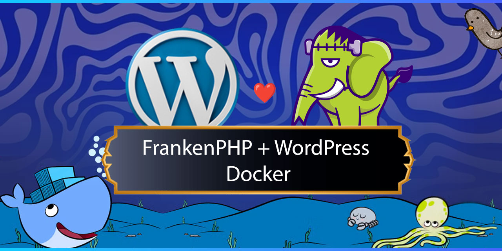

<p align="left">
    <picture>
      <source media="(prefers-color-scheme: dark)" srcset="./.imgs/header.jpg">
      
    </picture>
</p>

# FrankenPHP + WordPress 🚀

Welcome to this FrankenPHP-WordPress-Docker!
With just a few commands, you'll get a fully functional WordPress instance based on FrankenPHP, MariaDB – completely in Docker 🛳️.

---

## 📋 Prerequisites

* [Docker](https://docs.docker.com/get-docker/) ≥ 20.10
* [Docker Compose](https://docs.docker.com/compose/) (included by default in Docker v20.10+)
* `make` – pre-installed on macOS & Linux, on Windows available via [Git for Windows](https://gitforwindows.org/) or WSL.

---

## 🏗️ Installation

```bash
# 1) Clone the repository (if not already done)
git clone frankenphp-wordpress-docker
cd frankenphp-wordpress-docker

# 2) Download WordPress (creates ./wordpress)
make install-wp

# 4) Generate docker-compose for the desired environment
make build

# 5) Start the stack (FrankenPHP, MariaDB)
make up
```

Within seconds, you can access:

* 🔗 **WordPress**: [`http://localhost:8090`](http://localhost:8080)

---

## ⚙️ Makefile Commands

| Command               | Description |
|-----------------------|--------------|
| `make up`             | Build containers (if needed) & start them in the background |
| `make start`          | Start stopped containers |
| `make stop`           | Stop containers **without** deleting them |
| `make down`           | Stop and remove containers (Volumes remain) |
| `make logs`           | Follow live logs from all containers |
| `make build`          | Rebuild images |
| `make clean`          | Full reset: Remove containers, images, volumes & orphans |
| `make install-wp`     | Download latest WordPress source & extract to `./wordpress` |
| `make help`           | Overview of all targets |

---

## 🧩 Docker Services

| Service      | Purpose | Port                     |
|--------------|-------|--------------------------|
| **frankenphp** | PHP 8.4 Runtime + Webserver (Base: `dunglas/frankenphp:php8.4`) | Dev: 8090 → 80 |
| **db**         | MariaDB 11 with persistent volume storage (`db_data`) | 3306                     |

## 🔑 Environment Variables

All variables are managed in `.env` and used in `docker-compose.yml`:

| Variable            | Default     | Description                                                 |
|---------------------|-------------|--------------------------------------------------------------|
| `SERVER_NAME`       | `localhost` | Public domain/host of your WP site (FrankenPHP variable)    |
| `MYSQL_DATABASE`    | `wordpress` | Database name                                               |
| `MYSQL_USER`        | `user`      | DB user                                                     |
| `MYSQL_PASSWORD`    | `pass`      | DB password                                                 |
| `MYSQL_ROOT_PASSWORD` | `rootroot`  | Root password (internal only)                               |

> 🔒 **Security:** `.env` is listed in `.gitignore`. Never share real credentials in public repos!

## 🧹 Cleanup

```bash
make clean   # removes EVERYTHING (Containers, Images, Volumes)
```

---

## 🤝 License

See [`LICENSE`](LICENSE).

Have fun 🎉